# 💼 Resume and Portfolio Generator

A smart web-based Resume and Portfolio Generator with AI-assisted customization. This platform empowers users to create professional portfolios and ATS-friendly resumes with ease and personalization. From theme selection to AI-powered customization and previews — everything is streamlined for a seamless user experience.

## 🚀 Features

### 🌐 Landing Page
- Showcases the core services provided: **Portfolio Generator** and **Resume Generator**
- Clean, modern UI with navigation to both tools

### 📁 Portfolio Generator
- 🔶 **Form-based Portfolio Creation**: Collects essential information through a user-friendly form
- 🤖 **AI Assistance**: Smart AI suggestions while filling out the form to guide users in writing better descriptions and summaries
- 🎨 **Theme Selection**: Choose from multiple professional themes
- 🧩 **Live Preview and Customization**:
  - HTML preview of portfolio
  - AI customization of the code using human language instructions
  - Downloadable HTML file

### 📄 Resume Generator
- 📋 **ATS-friendly Resume Generation**: A clean, optimized format ready for recruiter screening tools
- 🤖 **AI Help While Filling the Form**
- 🎨 **Theme Options for Resumes**
- ⬇️ Downloadable PDF version of the resume
- ✍️ AI-based customization for summary or objective statements

---

## 📌 Future Enhancements / To-Do

The current version provides the core functionality, but the real vision lies ahead with a more personalized, intelligent, and community-driven platform. Here's what's coming next:

### 🔐 User Authentication and Dashboard
- Users will be able to register and log in.
- A dedicated dashboard to manage all their past resumes and portfolios at one place.

### 🗃️ Version Control & History Management
- Every resume and portfolio version will be saved automatically.
- Users can name, view, revert, or duplicate older versions.
  - Example: Resume V1, Resume V2, Portfolio V1, etc.

### 🎨 Custom Theme Upload & Public Sharing
- Users can design their own themes and apply them.
- Option to **make themes public**, allowing community reuse and access to a growing library of designs.

### 🌍 Multi-language Support
- Resumes and Portfolios can be generated in multiple languages based on job needs or region.
- Language toggle for both input and generated output.

### 🧠 AI-Based Scanning and Suggestion Toolbox
- Built-in scanning feature for:
  - Resume quality analysis
  - Keyword optimization based on target role
  - Portfolio improvement tips
- AI will **contextually suggest improvements** as per industry standards and job roles (e.g., “Add leadership achievements”, “Improve project section”).

### 📱 Mobile Responsiveness & App Version 
- Full responsiveness across devices
- A lightweight Android/Web app version may be added

---

## 🛠️ Tech Stack

- **Frontend**: HTML, CSS, JavaScript
- **Backend**: Flask (Python)
- **AI Integration**: Google Gemini API (Generative AI) and OpenAI
- **PDF Conversion**: `pdfkit`, `wkhtmltopdf`
- **Templating**: Jinja2 (Flask’s default template engine)
- **Database**: Flask-SQLAlchemy 

## 📸 UI Screenshots

### 🏠 Landing Page
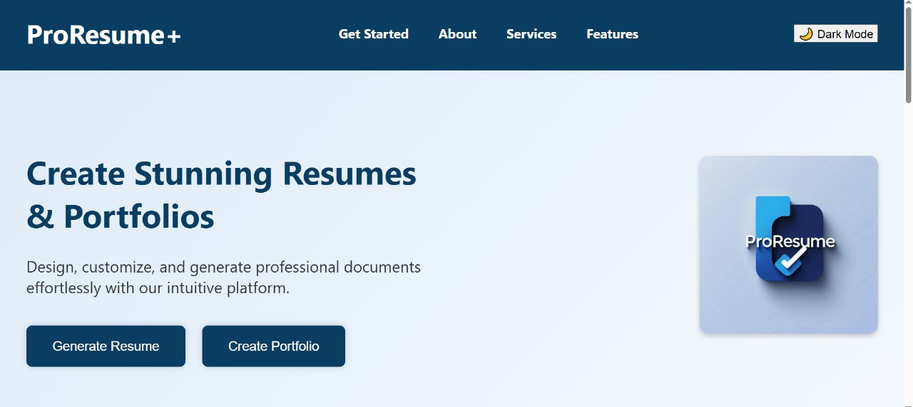


### 🚀 Features Section
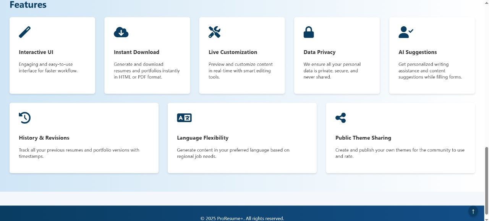

### 📝 Portfolio Form
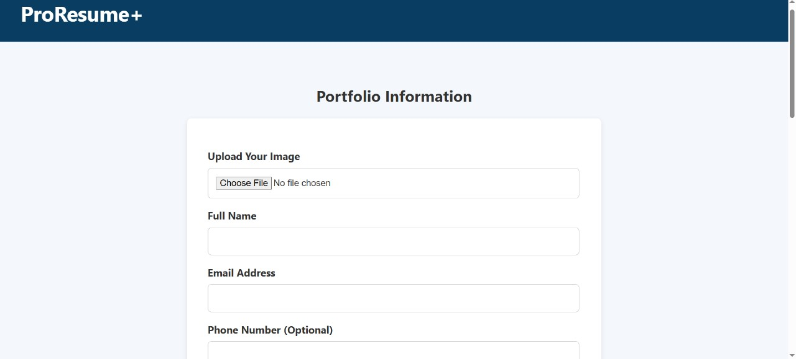
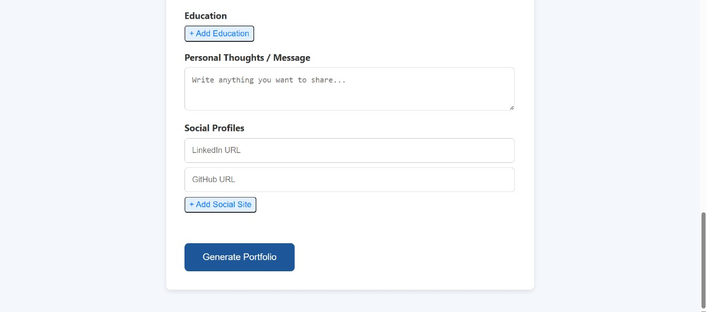

### 🧠 AI Help Popup
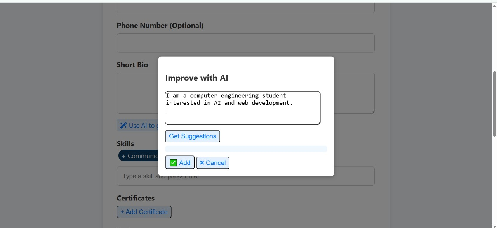

### 📄 Resume Type Selection
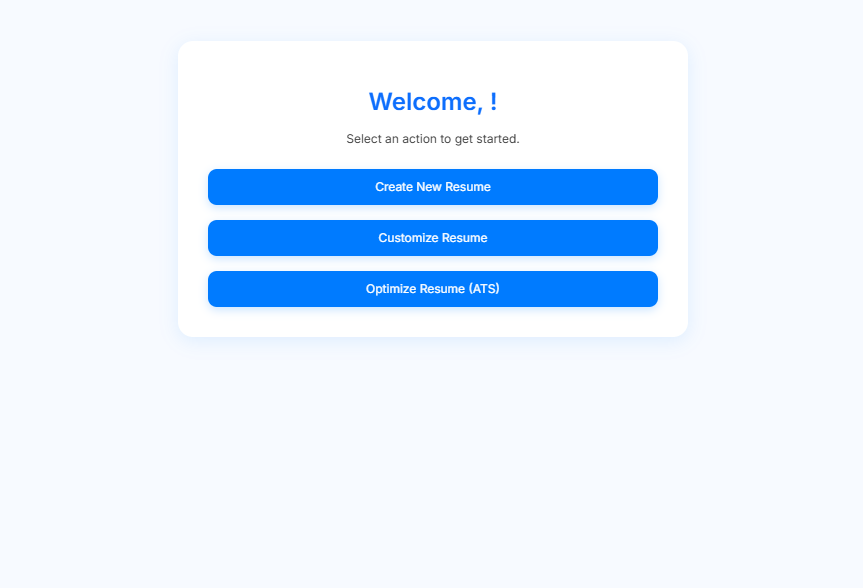
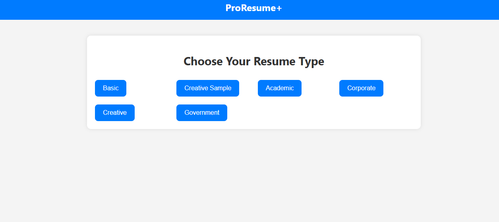

### 🎨 Resume Customization
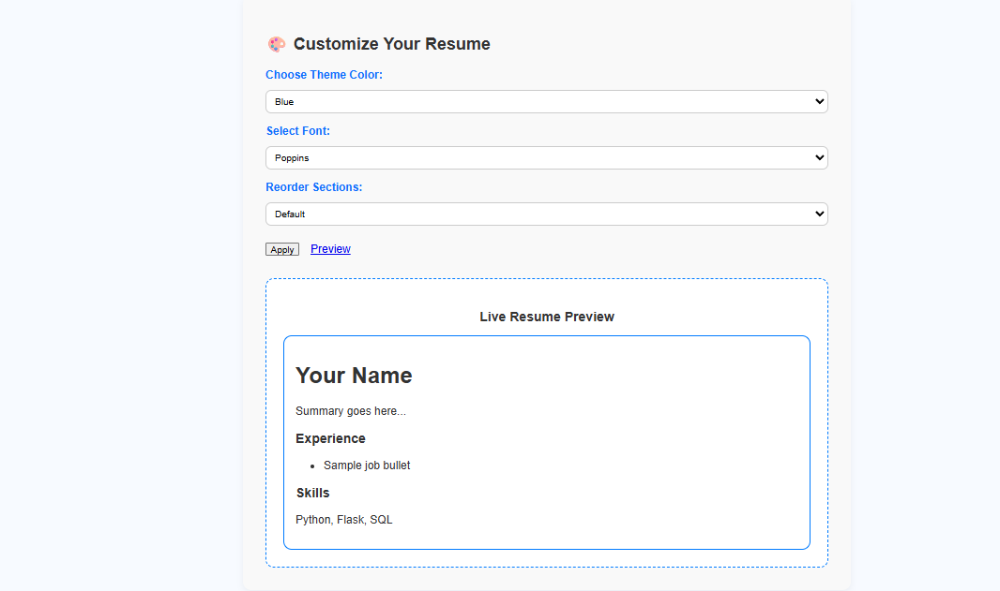

### 📥 Resume Download
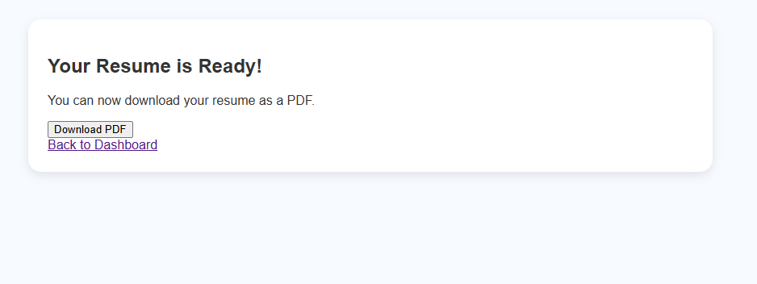

### 📃 Resume Preview
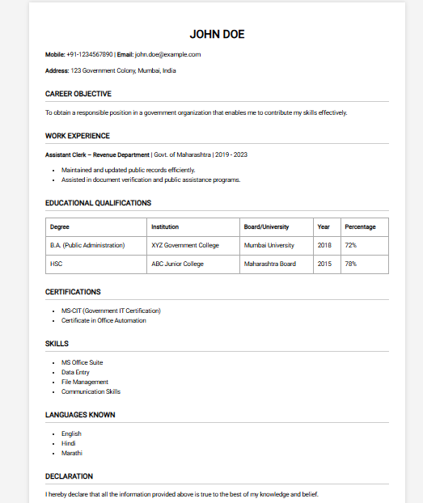

### 🛠 Services Page
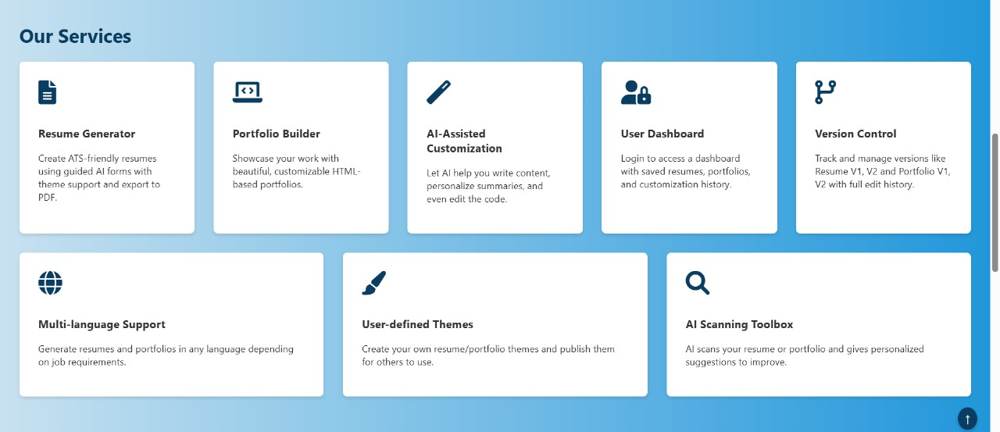

## 🔁 Workflow Overview

1. **User lands on homepage**
2. Selects either **Portfolio Generator** or **Resume Generator**
3. Fills out a form with AI suggestions
4. Selects a preferred theme
5. Reviews and customizes content via AI
6. Downloads final HTML (portfolio) or PDF (resume)

---

## 📦 Installation & Setup

### Prerequisites
- Python 3.x
- pip
- wkhtmltopdf installed on your system

### Clone the Repository
```bash
git clone https://github.com/your-username/Resume-and-Portfolio-Generator.git
cd Resume-and-Portfolio-Generator
```

### Create Virtual Environment
```bash
python -m venv venv
source venv/bin/activate  # For Linux/Mac
venv\Scripts\activate     # For Windows
```

### Install Requirements
```bash
pip install -r requirements.txt
```

### Run the Flask App
```bash
python app.py
Visit http://127.0.0.1:5000/ in your browser to access the app.
```

## 👨‍💻 Team

- <a href="https://github.com/Eshita-Badhe">**Eshita Badhe**</a> – Lead on Portfolio Customization & AI Integration  
- <a href="https://github.com/Aarya-Chaudhari"> **Aarya Chaudhari** </a> – Portfolio Generation and Theme Personalization  
- <a href="https://github.com/Ardra1804">**Ardra Patil**</a> – Resume Generation with Custom Templates  
- <a href="https://github.com/Tanayajadhav1">**Tanaya Jadhav**</a> – Resume Theme Design & Landing Page Styling  


Contributions by all team members are acknowledged and appreciated.

---

## 🤝 Contribution

Feel free to fork the repo, make changes, and open a pull request.  
For major changes, please open an issue first to discuss what you'd like to change.

---

Made with ❤️ by Team **BitVoyagers**

